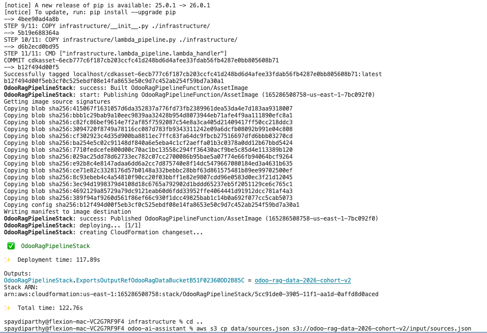
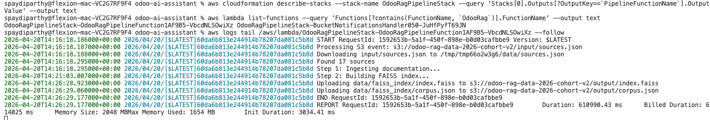
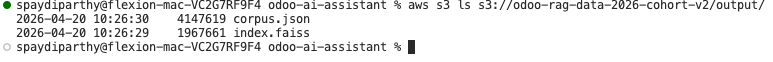
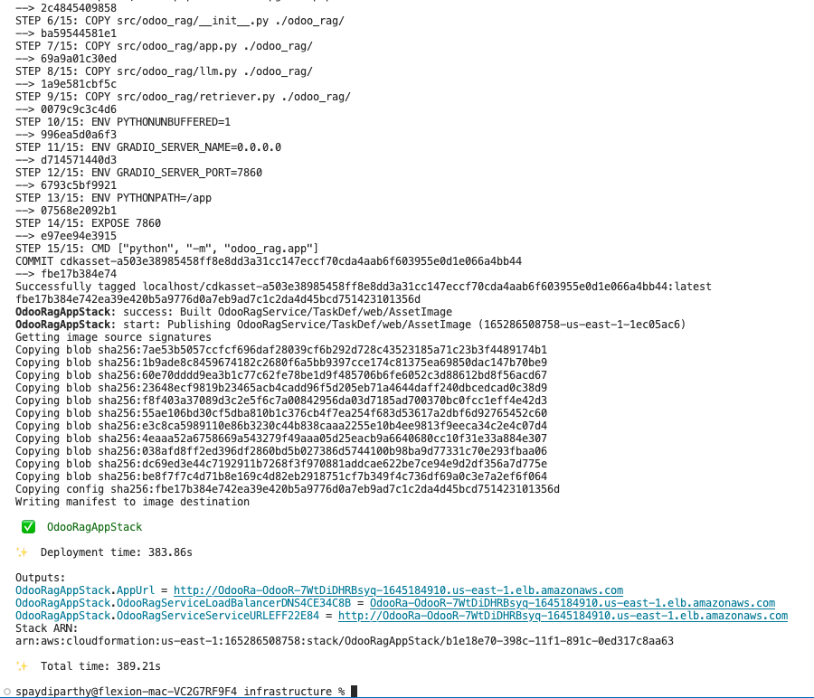
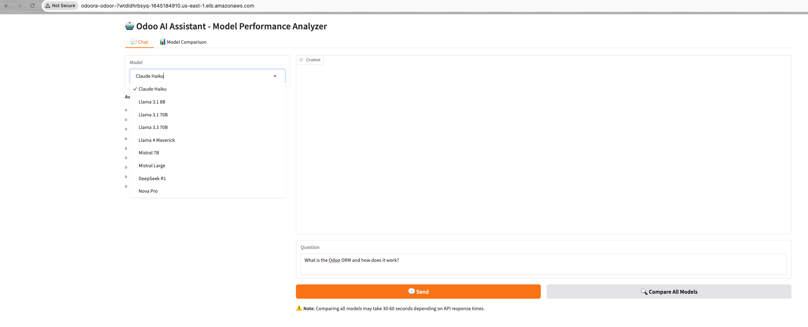
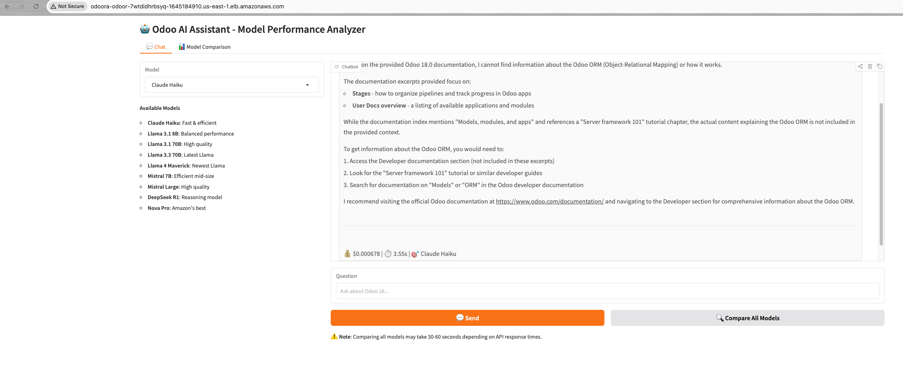
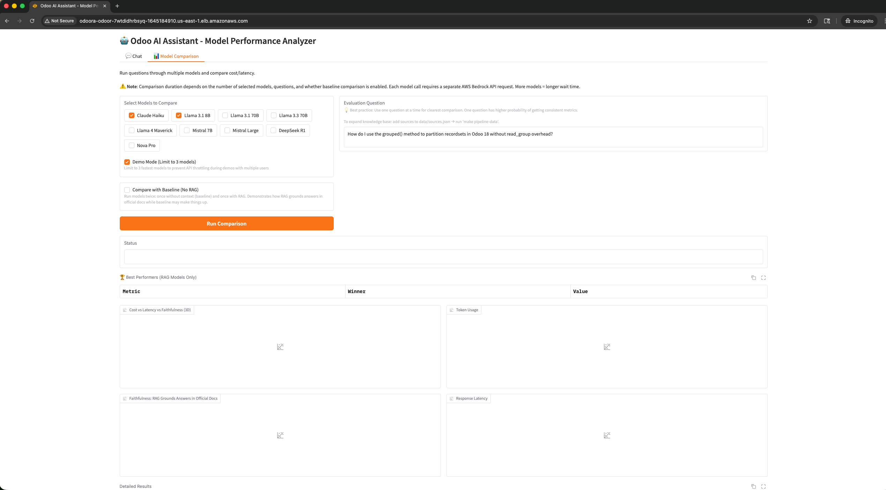
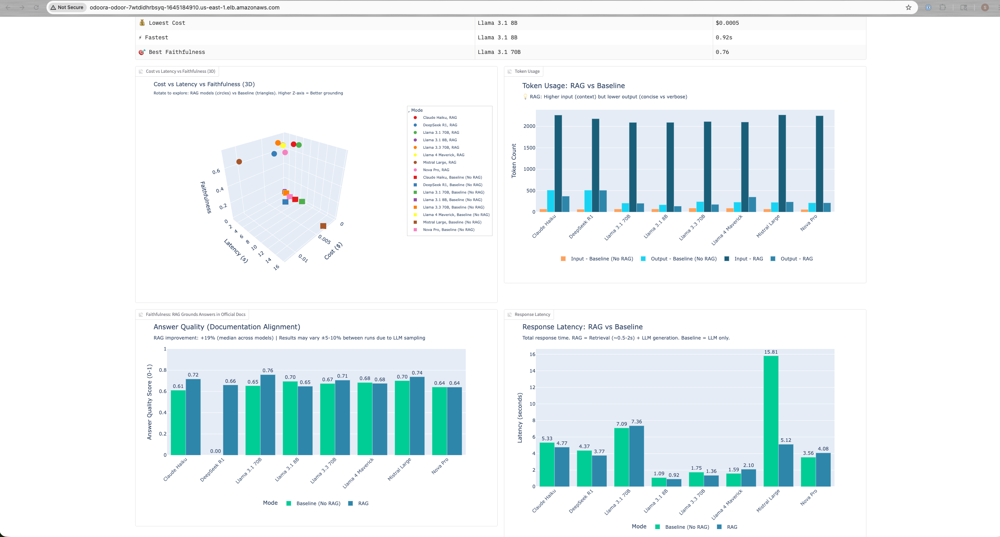
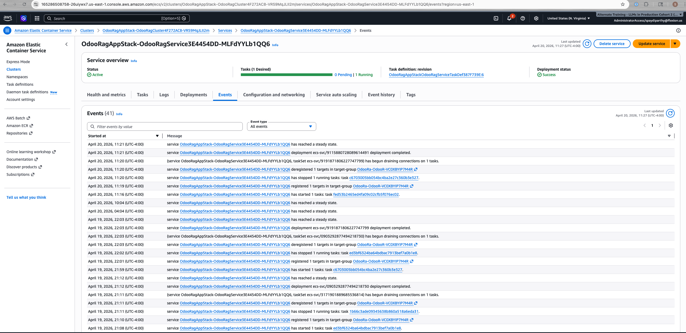
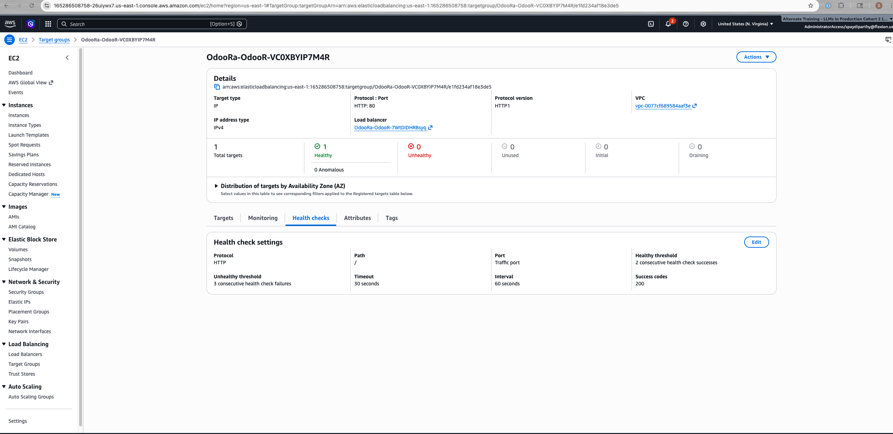

# Odoo RAG + Multi-Model Comparison

**Live Demo:** [http://odoora-odoor-7wtdidhrbsyq-1645184910.us-east-1.elb.amazonaws.com](http://odoora-odoor-7wtdidhrbsyq-1645184910.us-east-1.elb.amazonaws.com)

*To get current URL if it changes:*
```bash
aws cloudformation describe-stacks --stack-name OdooRagAppStack --query 'Stacks[0].Outputs[?OutputKey==`AppUrl`].OutputValue' --output text
```

AI-powered Odoo 18 documentation assistant with multi-model comparison and RAG metrics. Compare 9 AWS Bedrock models side-by-side on cost, latency, and answer quality.

**Key Features:**
- 🤖 **9 Bedrock Models**: Claude, Llama, Mistral, Nova, DeepSeek
- 📊 **RAG Metrics**: Faithfulness Score, Answer Quality
- 💰 **Cost Tracking**: Real-time per-query cost calculation
- ⚡ **Performance Analysis**: Cost, latency, token usage, quality scores
- 🎨 **Interactive UI**: Gradio-based chat and comparison interface

## Architecture

```
┌─────────────────────────────────────────────────────────────┐
│                     AWS Cloud (us-east-1)                    │
├─────────────────────────────────────────────────────────────┤
│                                                               │
│  ┌──────────────┐      ┌────────────────────────────────┐   │
│  │ S3 Bucket    │      │ Lambda (Pipeline)              │   │
│  │              │◄─────┤ - Triggered by sources.json    │   │
│  │ input/       │      │ - Scrapes docs (BeautifulSoup) │   │
│  │   sources.   │      │ - Builds FAISS index           │   │
│  │   json       │      │ - Uploads to S3 output/        │   │
│  │              │      └────────────────────────────────┘   │
│  │ output/      │                                            │
│  │   index.     │                                            │
│  │   faiss      │                                            │
│  │   corpus.    │                                            │
│  │   json       │                                            │
│  └──────┬───────┘                                            │
│         │ Downloads index on startup                         │
│         ▼                                                    │
│  ┌────────────────────────────────┐                         │
│  │ ECS Fargate (Gradio App)       │                         │
│  │ - 2 vCPU, 4GB memory           │                         │
│  │ - Runs Gradio server           │                         │
│  │ - Loads FAISS index from S3    │                         │
│  │ - Bedrock API integration      │                         │
│  └────────────┬───────────────────┘                         │
│               ▼                                              │
│  ┌────────────────────────────────┐                         │
│  │ Application Load Balancer      │                         │
│  │ - Public HTTP endpoint         │                         │
│  │ - WebSocket support            │                         │
│  └────────────────────────────────┘                         │
│               │                                              │
└───────────────┼──────────────────────────────────────────────┘
                │
                ▼
         Public URL: http://OdooR-OdooR-XXXXX.elb.amazonaws.com
```

## Screenshots

### Deployment

**Pipeline Stack Deployed**


**Pipeline Logs - Completed**


**S3 Output Files**


**App Stack Deployed**


### Gradio UI

**Chat Interface**


**Sample Response**


**Model Comparison Interface**


**Comparison Results with Charts**


### AWS Console

**ECS Service Running**


**ALB Target Health**


## Quick Start

### Local Development

Run the RAG system locally for development and testing:
- Install dependencies with `uv`
- Build FAISS index from Odoo documentation
- Launch Gradio UI at `http://localhost:7860`

**Details:** [5_local_deploy.md](docs/5_local_deploy.md)

### AWS Deployment

Deploys to ECS Fargate with automated data pipeline:
- S3-triggered Lambda for documentation ingestion
- FAISS index built and stored in S3
- Gradio app served via Application Load Balancer

**Details:** [6_cloud_deploy.md](docs/6_cloud_deploy.md)

## Project Structure

```
odoo-ai-assistant/
├── src/odoo_rag/              # Application code
│   ├── app.py                # Gradio UI (ECS entry point)
│   ├── llm.py                # Bedrock Converse API client
│   ├── retriever.py          # FAISS search
│   ├── indexer.py            # Build FAISS index
│   ├── ingest.py             # Scrape Odoo docs (BeautifulSoup)
│   └── generate_qa.py        # QA generation (unused - for fine-tuning)
├── infrastructure/            # AWS CDK stacks
│   ├── cdk_stack.py          # Pipeline + App stacks
│   ├── app.py                # CDK app entry point
│   ├── lambda_pipeline.py    # S3-triggered pipeline Lambda
│   ├── Dockerfile.pipeline   # Pipeline Docker image
│   └── requirements-lambda.txt
├── tests/                     # Test suite
│   ├── README.md             # Test documentation and coverage info
│   ├── test_app.py
│   ├── test_llm.py
│   ├── test_retriever.py
│   ├── test_indexer.py
│   └── test_ingest.py
├── data/
│   ├── sources.json          # URLs to scrape
│   ├── faiss_index/          # Generated index (gitignored)
│   └── raw/                  # Scraped docs (gitignored)
├── docs/                      # Documentation
│   ├── 1_decisions_plan.md   # Architectural decisions
│   ├── 2_project_summary.md  # High-level overview
│   ├── 3_reflections.md      # Lessons learned
│   ├── 4_future_improvements.md
│   ├── 5_local_deploy.md     # Local deployment guide
│   └── 6_cloud_deploy.md     # AWS deployment guide
├── scripts/
│   └── list_models.py        # List available Bedrock models
├── Dockerfile                 # Gradio app Docker image
├── Makefile                   # Development commands
├── pyproject.toml             # Python dependencies
├── uv.lock                    # Locked dependencies
└── README.md                  # This file
```

## Supported Models (9 Total)

| Model | Provider | Use Case | Cost |
|-------|----------|----------|------|
| Claude Haiku | Anthropic | Fast & reliable | Low |
| Llama 3.1 8B | Meta | Balanced | Very Low |
| Llama 3.1 70B | Meta | High quality | Medium |
| Llama 3.3 70B | Meta | Latest Llama | Medium |
| Llama 4 Maverick 17B | Meta | Newest Llama | Medium |
| Mistral 7B | Mistral AI | Efficient | Low |
| Mistral Large | Mistral AI | High quality | Medium |
| DeepSeek R1 | DeepSeek | Reasoning | Medium |
| Nova Pro | Amazon | Amazon's best | Medium |

*All models accessed via AWS Bedrock Converse API.*

## Features

### 1. Interactive Chat Interface
- Select from 9 Bedrock models
- Real-time RAG-powered responses
- Cost and latency tracking per query

### 2. Multi-Model Comparison
- Compare up to 9 models side-by-side
- Baseline vs RAG comparison mode
- Demo mode (limits to 3 models)
- 4 visualization charts:
  - Cost vs Latency vs Faithfulness (3D)
  - Token Usage bar chart
  - Answer Quality comparison
  - Response Latency

### 3. RAG Metrics

Both metrics use semantic similarity (cosine similarity of sentence embeddings) between the generated answer and retrieved context:

| Metric | Range | What It Measures |
|--------|-------|------------------|
| **Faithfulness** | 0-1 | Semantic similarity between answer and retrieved context |
| **Answer Quality** | 0-1 | Same as Faithfulness (measures context alignment) |

RAG models typically score higher than baseline models because RAG answers are grounded in retrieved documentation. Actual scores vary based on the question and how well the documentation covers the topic.

### 4. Automated Data Pipeline
S3-triggered Lambda rebuilds knowledge base automatically:

```
sources.json uploaded to S3
         ↓
Lambda: ingest → chunk → embed → build index
         ↓
Upload index.faiss + corpus.json to S3
         ↓
Gradio app uses new index on next request
```

## Example Questions

### Questions That Show RAG Improvement

**Recommendation:** Use one question at a time for model comparison to reduce LLM variance.

These questions consistently demonstrate RAG value (tested with 9 models):

```
How do I use the grouped() method to partition recordsets in Odoo 18 without read_group overhead?
How can I partition existing recordsets without the overhead of a read_group() in Odoo?
How do I enable the EU Intra-community Distance Selling feature in Odoo?
How can I deregister from Peppol in Odoo?
Why doesn't @api.onchange trigger when I modify a one2many field in Odoo 18?
```

### Questions That Work Well (General)

These match the indexed documentation and produce accurate answers:

```
What is the Odoo ORM and how does it work?
How do you define a model in Odoo?
What are the different field types available?
How does model inheritance work in Odoo?
What is the difference between Model and TransientModel?
How do you create a computed field in Odoo?
```

### Questions That Show RAG Limitations

These demonstrate when RAG correctly reports "context does not contain information":

**Odoo topics not in indexed documentation:**
```
How do I set up email marketing campaigns?
How do I configure HR recruitment workflows?
How do I set up project management in Odoo?
```

**Non-Odoo questions (out of scope):**
```
What is Python?
How do I create a REST API?
What is the difference between SQL and NoSQL?
How do I deploy a Django application?
```

Models correctly report "no information" rather than hallucinating. This demonstrates the value of grounding answers in retrieved context.

## Cost Estimate (Monthly)

| Service | Usage | Cost |
|---------|-------|------|
| ECS Fargate | 2 vCPU, 4GB, 24/7 | $30.00 |
| Application Load Balancer | 1 ALB, minimal traffic | $16.00 |
| S3 Storage | 100MB | $0.002 |
| Lambda (Pipeline) | 1 run/day @ 10 min | $1.00 |
| Bedrock API | 100 requests/day | $2.00 |
| **Total** | | **~$50/month** |

*ECS Fargate is the main cost driver. Production deployments can reduce costs by scaling down or using Fargate Spot.*

## Documentation

- **[1_decisions_plan.md](docs/1_decisions_plan.md)** - Architectural decisions (RAG vs fine-tuning, vector storage, deployment platform)
- **[2_project_summary.md](docs/2_project_summary.md)** - High-level overview
- **[3_reflections.md](docs/3_reflections.md)** - Lessons learned (Lambda → ECS Fargate pivot, model availability)
- **[4_future_improvements.md](docs/4_future_improvements.md)** - Planned enhancements
- **[5_local_deploy.md](docs/5_local_deploy.md)** - Local deployment guide
- **[6_cloud_deploy.md](docs/6_cloud_deploy.md)** - AWS deployment guide (ECS Fargate + CDK)

## Key Learnings

Key architectural decisions and lessons learned:
- Lambda → ECS Fargate migration (WebSocket support, no init timeout)
- RAG vs fine-tuning decision (faster iteration, enables multi-model comparison)
- Chunking strategy (word-based outperformed semantic chunking)
- Single-question evaluation (more stable than multi-question averaging)
